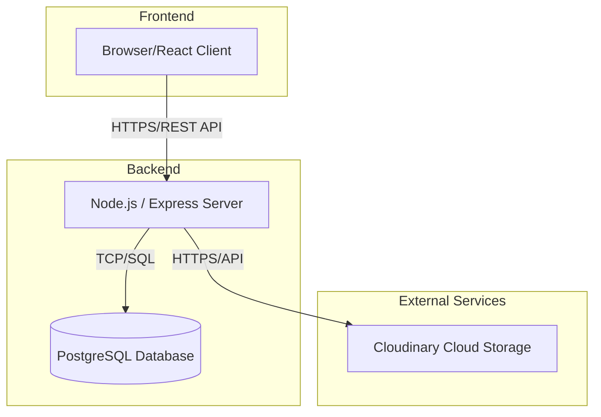
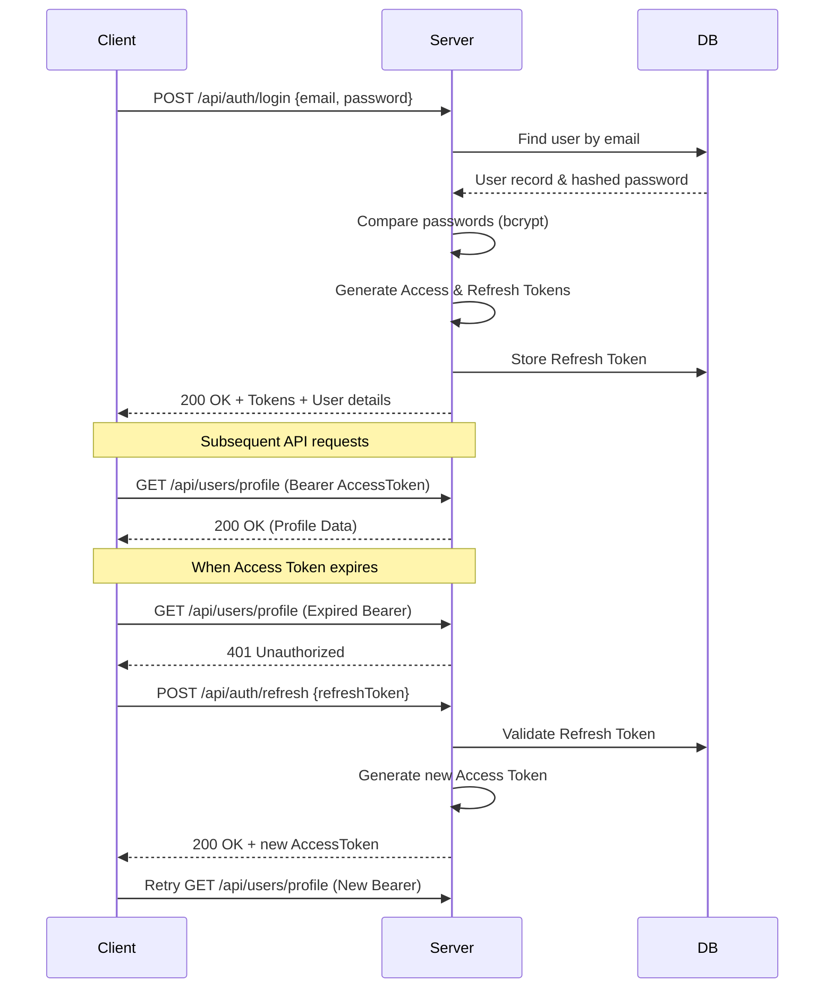
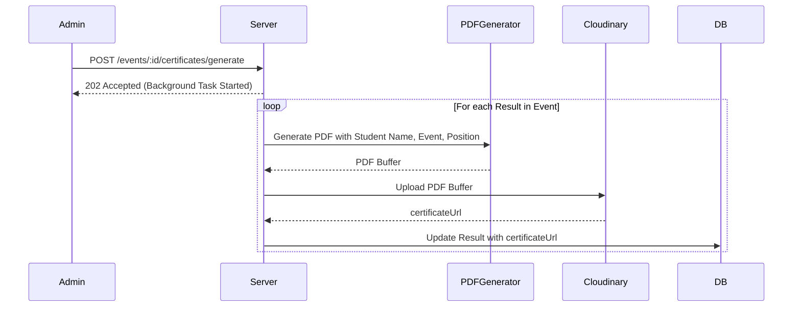

# Campus Activity Management System (CAMS) Architecture

## 1. System Architecture Overview

CAMS uses a standard client-server architecture with a modern web stack.



*   **Client**: A React Single Page Application (SPA) providing UI for both Students and Admins.
*   **Server**: A Node.js backend using Express.js to handle API requests, business logic, and authentication.
*   **Database**: PostgreSQL relational database accessed via Prisma ORM for data persistence.
*   **Cloudinary**: External service used for storing uploaded event posters and generated certificate PDFs.

### Communication Patterns
*   **Client-Server**: RESTful HTTP API.
*   **Data Flow**: The client requests data (JSON) or submits data. The server validates, interacts with the database via Prisma, performs operations like PDF generation or Cloudinary uploads, and returns JSON responses.

---

## 2. Frontend Architecture

*   **Framework**: React with TypeScript.
*   **Routing**: React Router for SPA navigation.
    *   `Public Routes`: `/login`, `/register`, `/events` (view only).
    *   `Protected Routes (Student)`: `/dashboard`, `/profile`, `/my-registrations`.
    *   `Protected Routes (Admin)`: `/admin/*`, `/admin/events/create`, `/admin/analytics`.
    *   `Role-based Guards`: Higher-Order Components (HOCs) or wrapper components to protect admin routes.
*   **State Management**:
    *   `React Context`: Used for global Auth state (user details, tokens).
    *   `React Query`: Used for server state management (fetching, caching, synchronizing, and updating asynchronous data).
*   **Form Handling & Validation**: React Hook Form coupled with Zod for robust client-side validation schemas.
*   **API Layer**: Axios instance with interceptors:
    *   *Request Interceptor*: Attaches JWT Bearer token to headers.
    *   *Response Interceptor*: Handles 401 Unauthorized errors to trigger token refresh flow automatically.
*   **UI Component Library**: Shadcn/UI for accessible, customizable components, styled with Tailwind CSS.
*   **Error & Loading States**: Global error boundary, React Query's `isLoading`/`isError` flags, and toast notifications (e.g., React Hot Toast).

---

## 3. Backend Architecture

*   **Framework**: Express.js with TypeScript.
*   **Layered Architecture**:
    *   **Routes**: Defines API endpoints and maps them to controllers.
    *   **Controllers**: Handles HTTP request/response, extracts parameters, calls services.
    *   **Services**: Contains core business logic (e.g., checking deadlines, generating PDFs).
    *   **Repository/Prisma**: Database access layer.
*   **Middleware Pipeline**:
    *   `helmet()`: Security headers.
    *   `cors()`: Cross-Origin Resource Sharing.
    *   `express.json()`: Body parsing.
    *   `authMiddleware`: Validates JWT.
    *   `roleMiddleware`: Checks if the user is ADMIN/STUDENT.
    *   `validateMiddleware(zodSchema)`: Validates request body/params.
    *   `errorHandler`: Global error catching.

---

## 4. Monorepo Folder Structure

```text
d:\CAMS_PJ\
├── apps/
│   ├── backend/                # Express.js API server
│   │   ├── src/
│   │   │   ├── controllers/    # Request handlers
│   │   │   ├── middlewares/    # Auth, validation, error handlers
│   │   │   ├── routes/         # API route definitions
│   │   │   ├── services/       # Business logic
│   │   │   ├── utils/          # Helpers (PDFgen, Cloudinary)
│   │   │   ├── app.ts          # Express app setup
│   │   │   └── server.ts       # Entry point
│   │   ├── prisma/             # Prisma schema and migrations
│   │   ├── .env.example
│   │   ├── package.json
│   │   └── tsconfig.json
│   └── frontend/               # React SPA client
│       ├── src/
│       │   ├── assets/         # Images, global styles
│       │   ├── components/     # Reusable UI (Shadcn)
│       │   ├── hooks/          # Custom hooks (React Query)
│       │   ├── pages/          # Route components (Views)
│       │   ├── services/       # Axios API calls
│       │   ├── store/          # React Context (Auth)
│       │   ├── utils/          # Helpers
│       │   ├── App.tsx         # Main component, Router setup
│       │   └── main.tsx        # Entry point
│       ├── .env.example
│       ├── package.json
│       ├── tsconfig.json
│       └── vite.config.ts
├── packages/
│   └── shared-types/           # Shared TS interfaces and Zod schemas
│       ├── src/
│       │   ├── index.ts        # Exports
│       │   ├── models/         # DB interfaces
│       │   └── schemas/        # Zod validation schemas
│       ├── package.json
│       └── tsconfig.json
├── docs/                       # Documentation (Architecture, DB, API)
├── package.json                # Monorepo root config (Turborepo/npm workspaces)
└── README.md
```

---

## 5. Authentication & Authorization Flow

*   **Strategy**: JWT Access Tokens (short-lived, e.g., 15m) + Refresh Tokens (long-lived, e.g., 7d).
*   **Password Hashing**: `bcrypt` (salt rounds: 10).



---

## 6. Event Management Flow

**Event State Machine:**
`DRAFT` → `UPCOMING` → `ONGOING` → `COMPLETED`
(Any state) → `CANCELLED`

**Creation Flow:**
1. Admin fills Event details in frontend form.
2. Selects an image for the poster.
3. Submits form.
4. Backend receives data + image (multipart/form-data).
5. Backend uploads image to Cloudinary, receives `posterUrl`.
6. Backend saves Event record to DB with `posterUrl`.

---

## 7. Registration Flow

**Workflow:**
1. Student views `UPCOMING` event.
2. Clicks "Register".
3. Backend Validation:
    *   Is the user a STUDENT?
    *   Does the event exist and is it `UPCOMING`?
    *   Is `registrationDeadline` > `now()`?
    *   Is `studentId` + `eventId` already in `Registration` table?
4. If valid, create `Registration` record.

---

## 8. Result Management Flow

1. Event moves to `COMPLETED` state.
2. Admin navigates to Event Results page.
3. Admin selects participants and assigns positions (1st, 2nd, 3rd, Participant).
4. Submits bulk result array to backend.
5. Backend creates/updates records in `Result` table.

---

## 9. Certificate Generation Workflow



---

## 10. Cloudinary Integration Workflow

*   **Strategy**: Server-side proxy. The client sends files to the Node.js server, which authenticates and uploads to Cloudinary securely to hide API keys.
*   **Folder Structure**: `cams/posters/`, `cams/certificates/`.

---

## 11. Deployment Architecture

*   **Frontend**: Vercel or Netlify (Static site hosting).
*   **Backend**: Render, Railway, or Heroku (Node.js environment).
*   **Database**: Supabase, Neon, or Render PostgreSQL (Managed DB).
*   **CI/CD**: GitHub Actions for linting, testing, and triggering deployments on `main` branch merges.

---

## 12. Security Best Practices

*   **Validation**: Zod schemas used on both frontend and backend for strict typing and sanitization.
*   **Headers**: `helmet.js` to prevent XSS, clickjacking.
*   **CORS**: Configured strictly to allow only the frontend origin.
*   **SQL Injection**: Prevented inherently by Prisma ORM's parameterized queries.
*   **Auth**: Passwords never logged or returned. JWTs signed with strong secrets.
*   **Rate Limiting**: `express-rate-limit` to prevent brute force and DoS attacks.

---

## 13. Scalability Considerations

*   **Database**: Add indexes on frequently queried fields (`eventId`, `studentId`, `email`, `status`).
*   **Pagination**: All list endpoints (`/events`, `/registrations`) must use pagination (`page`, `limit`) to prevent massive payload sizes.
*   **Stateless Backend**: JWT authentication makes the Node.js server stateless, allowing horizontal scaling behind a load balancer.
*   **Background Jobs**: Certificate generation can be moved to a worker queue (e.g., Redis + BullMQ) if scaling is needed, to avoid blocking the main event loop.
