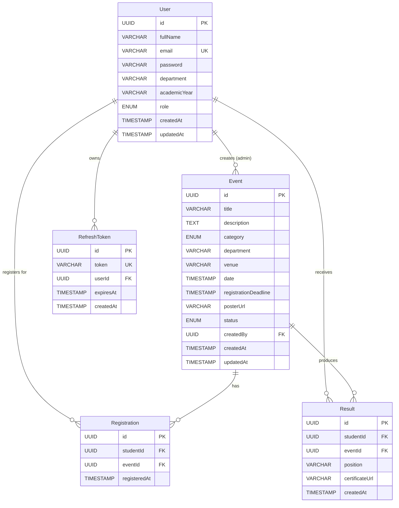
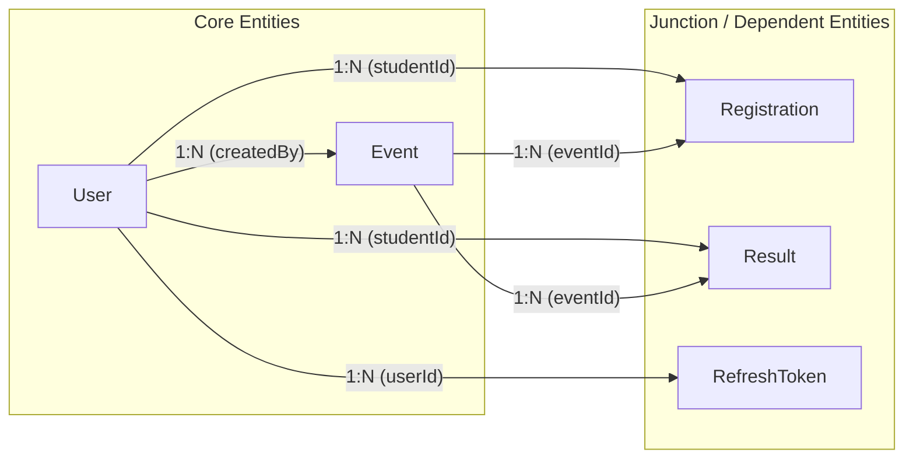
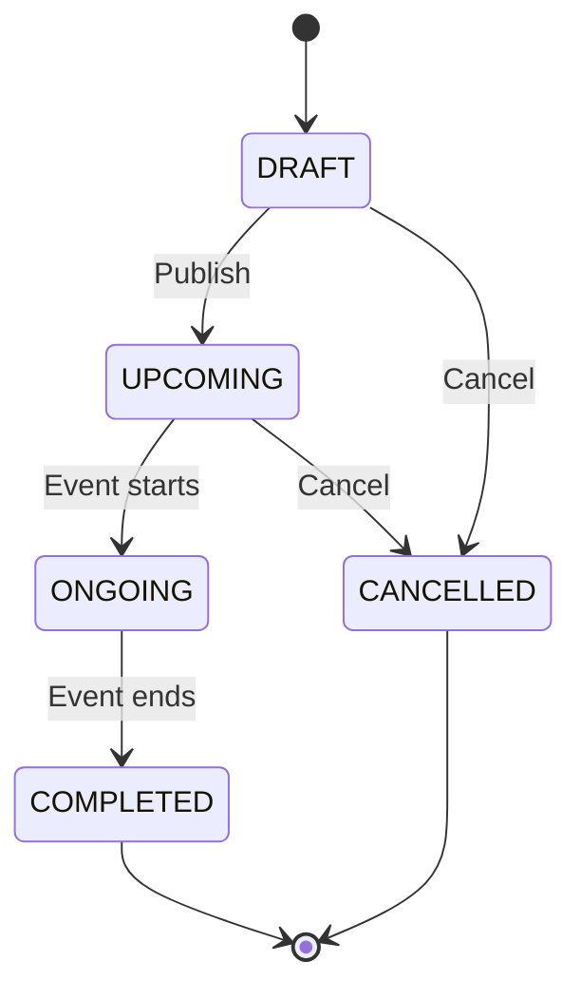
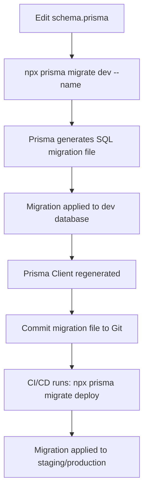

# CAMS — Database Design Document

> **Project**: Campus Activity Management System (CAMS)
> **Version**: 1.0.0
> **Last Updated**: 2026-06-15
> **Status**: Approved — Ready for Implementation
> **Audience**: Backend Engineers, DBAs, QA

---

## Table of Contents

1. [Database Overview](#1-database-overview)
2. [Entity-Relationship Diagram](#2-entity-relationship-diagram)
3. [Detailed Schema Design](#3-detailed-schema-design)
4. [Relationships](#4-relationships)
5. [Indexes](#5-indexes)
6. [Enums](#6-enums)
7. [Prisma Schema Design Notes](#7-prisma-schema-design-notes)
8. [Data Integrity & Constraints](#8-data-integrity--constraints)
9. [Seed Data Strategy](#9-seed-data-strategy)
10. [Migration Strategy](#10-migration-strategy)

---

## 1. Database Overview

### 1.1 Purpose & Scope

This document specifies the complete relational database design for **CAMS** — a platform that allows educational institutions to manage campus events, track student registrations, record results, and generate participation certificates.

The database must support:

| Capability | Description |
|---|---|
| **User management** | Student self-registration, admin-managed accounts, role-based access |
| **Event lifecycle** | Creation → publication → registration → execution → result recording |
| **Registration tracking** | Unique student-to-event sign-ups with deadline enforcement |
| **Result management** | Position recording, certificate URL storage |
| **Authentication** | JWT access tokens paired with rotatable refresh tokens |
| **Audit trail** | `createdAt` / `updatedAt` timestamps on every mutable entity |

### 1.2 RDBMS Choice — PostgreSQL

| Criterion | Why PostgreSQL |
|---|---|
| **ACID compliance** | Full transactional integrity for financial-grade consistency of registration records |
| **Native ENUM support** | First-class `CREATE TYPE ... AS ENUM` maps cleanly to Prisma enums |
| **UUID generation** | Built-in `gen_random_uuid()` (PG 13+) eliminates application-layer ID generation |
| **JSON/B columns** | Future extensibility for storing event metadata or form responses |
| **Index types** | B-tree (default), GIN (full-text search on event titles/descriptions), partial indexes |
| **Ecosystem** | Mature tooling, broad hosting support (Supabase, Neon, Railway, RDS) |
| **Prisma tier-1** | PostgreSQL is Prisma's primary supported connector |

### 1.3 ORM Choice — Prisma

| Criterion | Why Prisma |
|---|---|
| **Type safety** | Auto-generated TypeScript client gives compile-time guarantees |
| **Declarative schema** | Single `schema.prisma` file is the source of truth for models, relations, and enums |
| **Migration engine** | `prisma migrate dev` produces SQL migrations, tracks history, supports rollbacks |
| **Introspection** | `prisma db pull` can reverse-engineer an existing database |
| **Query engine** | Rust-based query engine with connection pooling and prepared statements |
| **Relation API** | Fluent nested reads/writes (`include`, `select`, `connect`, `create`) |

### 1.4 Naming Conventions

| Element | Convention | Example |
|---|---|---|
| Table names | PascalCase (Prisma model name) | `User`, `Event`, `Registration` |
| Column names | camelCase | `fullName`, `createdAt`, `registrationDeadline` |
| Primary keys | `id` | `User.id` |
| Foreign keys | `<related_model>Id` in camelCase | `studentId`, `eventId`, `createdBy` |
| Enums | PascalCase type, SCREAMING_SNAKE values | `Role { STUDENT, ADMIN }` |
| Indexes | `idx_<table>_<columns>` | `idx_event_status_date` |
| Unique constraints | `uq_<table>_<columns>` | `uq_registration_student_event` |
| Timestamps | `createdAt`, `updatedAt` | — |
| Boolean flags | `is<Adjective>` (if added later) | `isVerified`, `isActive` |

> [!NOTE]
> Prisma maps PascalCase model names to PascalCase table names by default. Use `@@map("snake_case_name")` only if the hosting environment mandates snake_case table names. This project uses Prisma defaults.

---

## 2. Entity-Relationship Diagram



### Cardinality Summary

| Relationship | Cardinality | Description |
|---|---|---|
| `User` → `Event` | 1 : N | One admin creates many events |
| `User` → `Registration` | 1 : N | One student has many registrations |
| `User` → `Result` | 1 : N | One student has many results |
| `User` → `RefreshToken` | 1 : N | One user owns many refresh tokens (multi-device) |
| `Event` → `Registration` | 1 : N | One event has many registrations |
| `Event` → `Result` | 1 : N | One event produces many results |

> [!IMPORTANT]
> There is no direct M:N relationship. The `Registration` and `Result` tables act as **explicit join tables** with their own primary keys and additional payload columns (`registeredAt`, `position`, `certificateUrl`). This is intentional — Prisma's implicit M:N syntax (`@relation`) does not support extra columns on the join table.

---

## 3. Detailed Schema Design

### 3.1 User

Stores all authenticated users — both students and administrators.

| # | Column | PostgreSQL Type | Constraints | Description |
|---|---|---|---|---|
| 1 | `id` | `UUID` | `PK`, `DEFAULT gen_random_uuid()` | Unique identifier, auto-generated |
| 2 | `fullName` | `VARCHAR(100)` | `NOT NULL` | Student or admin display name |
| 3 | `email` | `VARCHAR(255)` | `NOT NULL`, `UNIQUE` | Institutional or personal email; used for login |
| 4 | `password` | `VARCHAR(255)` | `NOT NULL` | bcrypt hash (60 chars); **never** stored in plaintext |
| 5 | `department` | `VARCHAR(100)` | `NOT NULL` | Academic department (e.g., "Computer Science") |
| 6 | `academicYear` | `VARCHAR(20)` | `NOT NULL` | Current year of study: `FY`, `SY`, `TY`, `Final` |
| 7 | `role` | `ENUM Role` | `NOT NULL`, `DEFAULT 'STUDENT'` | Discriminator for RBAC; see [§6 Enums](#6-enums) |
| 8 | `createdAt` | `TIMESTAMP(3)` | `NOT NULL`, `DEFAULT now()` | Account creation timestamp (ms precision) |
| 9 | `updatedAt` | `TIMESTAMP(3)` | `NOT NULL`, auto-update | Last profile modification timestamp |

**Notes**:
- `password` stores a bcrypt hash that is always 60 characters. The `VARCHAR(255)` allocation is intentionally generous to accommodate future migration to argon2id (which produces longer hashes).
- `academicYear` is a free-form `VARCHAR` rather than an enum because institutions use different year naming schemes ("FY"/"SY" vs "Year 1"/"Year 2" vs "Freshman"/"Sophomore").
- `role` defaults to `STUDENT`. Admin accounts are created via seeding or manual promotion — there is no public admin registration endpoint.

---

### 3.2 Event

Central entity representing a campus activity or event.

| # | Column | PostgreSQL Type | Constraints | Description |
|---|---|---|---|---|
| 1 | `id` | `UUID` | `PK`, `DEFAULT gen_random_uuid()` | Unique event identifier |
| 2 | `title` | `VARCHAR(200)` | `NOT NULL` | Event title displayed in listings and search |
| 3 | `description` | `TEXT` | `NULLABLE` | Rich-text or markdown event description |
| 4 | `category` | `ENUM EventCategory` | `NOT NULL` | Classification for filtering; see [§6](#6-enums) |
| 5 | `department` | `VARCHAR(100)` | `NULLABLE` | Hosting department; `NULL` = institution-wide event |
| 6 | `venue` | `VARCHAR(200)` | `NOT NULL` | Physical or virtual location |
| 7 | `date` | `TIMESTAMP(3)` | `NOT NULL` | Scheduled event date and time |
| 8 | `registrationDeadline` | `TIMESTAMP(3)` | `NOT NULL` | Cut-off for new registrations |
| 9 | `posterUrl` | `VARCHAR(500)` | `NULLABLE` | Cloudinary URL for event poster image |
| 10 | `status` | `ENUM EventStatus` | `NOT NULL`, `DEFAULT 'DRAFT'` | Lifecycle state; see [§6](#6-enums) |
| 11 | `createdBy` | `UUID` | `FK → User.id`, `NOT NULL` | Admin who created the event |
| 12 | `createdAt` | `TIMESTAMP(3)` | `NOT NULL`, `DEFAULT now()` | Record creation timestamp |
| 13 | `updatedAt` | `TIMESTAMP(3)` | `NOT NULL`, auto-update | Last modification timestamp |

**Notes**:
- `description` is `TEXT` (unlimited length) because event descriptions may include formatted content, schedules, rules, and contact information.
- `posterUrl` is nullable because poster upload is optional and may happen after initial event creation (DRAFT → upload → UPCOMING).
- `registrationDeadline` must be **before** `date` — this is enforced at the application layer, not via a `CHECK` constraint, because Prisma does not support cross-column `CHECK` constraints natively.

---

### 3.3 Registration

Join entity linking a student to an event they have registered for.

| # | Column | PostgreSQL Type | Constraints | Description |
|---|---|---|---|---|
| 1 | `id` | `UUID` | `PK`, `DEFAULT gen_random_uuid()` | Unique registration identifier |
| 2 | `studentId` | `UUID` | `FK → User.id`, `NOT NULL` | The student who registered |
| 3 | `eventId` | `UUID` | `FK → Event.id`, `NOT NULL` | The event being registered for |
| 4 | `registeredAt` | `TIMESTAMP(3)` | `NOT NULL`, `DEFAULT now()` | When the registration occurred |

**Composite Unique Constraint**:

```
@@unique([studentId, eventId])   →   uq_registration_student_event
```

This prevents a student from registering for the same event twice.

---

### 3.4 Result

Records a student's outcome for an event they participated in.

| # | Column | PostgreSQL Type | Constraints | Description |
|---|---|---|---|---|
| 1 | `id` | `UUID` | `PK`, `DEFAULT gen_random_uuid()` | Unique result identifier |
| 2 | `studentId` | `UUID` | `FK → User.id`, `NOT NULL` | The student who participated |
| 3 | `eventId` | `UUID` | `FK → Event.id`, `NOT NULL` | The event in question |
| 4 | `position` | `VARCHAR(50)` | `NOT NULL` | Outcome: `"1st"`, `"2nd"`, `"3rd"`, `"Participant"`, etc. |
| 5 | `certificateUrl` | `VARCHAR(500)` | `NULLABLE` | Cloudinary URL for the generated certificate PDF |
| 6 | `createdAt` | `TIMESTAMP(3)` | `NOT NULL`, `DEFAULT now()` | When the result was recorded |

**Composite Unique Constraint**:

```
@@unique([studentId, eventId])   →   uq_result_student_event
```

This ensures a student has at most one result record per event.

**Design Decision — `position` as VARCHAR vs ENUM**:

| Option | Pros | Cons |
|---|---|---|
| `VARCHAR(50)` ✅ | Flexible — supports "1st", "2nd", "Honorable Mention", "Best Speaker", custom titles | No compile-time validation of allowed values |
| `ENUM ResultPosition` | Type-safe, self-documenting | Rigid — every new position type requires a migration |

**Chosen**: `VARCHAR(50)`. Events vary widely (hackathons, debates, sports, workshops), and the set of meaningful position labels is not fixed. Application-level validation with Zod ensures only expected values are stored.

---

### 3.5 RefreshToken

Stores long-lived refresh tokens for JWT-based authentication with token rotation.

| # | Column | PostgreSQL Type | Constraints | Description |
|---|---|---|---|---|
| 1 | `id` | `UUID` | `PK`, `DEFAULT gen_random_uuid()` | Unique token record identifier |
| 2 | `token` | `VARCHAR(500)` | `NOT NULL`, `UNIQUE` | The opaque refresh token string |
| 3 | `userId` | `UUID` | `FK → User.id`, `NOT NULL` | Owner of this token |
| 4 | `expiresAt` | `TIMESTAMP(3)` | `NOT NULL` | Absolute expiry timestamp |
| 5 | `createdAt` | `TIMESTAMP(3)` | `NOT NULL`, `DEFAULT now()` | When the token was issued |

**Notes**:
- On every token refresh, the old token row is **deleted** and a new one is inserted (rotation). This limits the blast radius of a leaked refresh token.
- A scheduled job or application-level cleanup should periodically purge rows where `expiresAt < now()`.
- Multiple rows per user are allowed to support concurrent sessions across devices.

---

## 4. Relationships

### 4.1 Relationship Map



### 4.2 Detailed Relationship Definitions

#### 4.2.1 User → Event (Admin creates Events)

| Property | Value |
|---|---|
| **FK column** | `Event.createdBy` |
| **References** | `User.id` |
| **Cardinality** | One User (admin) creates zero or many Events |
| **Required** | Yes — every event must have a creator |
| **ON DELETE** | `RESTRICT` — cannot delete an admin who has created events; reassign first |
| **ON UPDATE** | `CASCADE` — if the user's ID changes (unlikely with UUIDs), propagate |

> [!WARNING]
> Deleting an admin account that owns events would orphan those events. The application must enforce admin account deactivation (soft delete) rather than hard deletion, or reassign event ownership before account removal.

#### 4.2.2 User → Registration (Student registers for Events)

| Property | Value |
|---|---|
| **FK column** | `Registration.studentId` |
| **References** | `User.id` |
| **Cardinality** | One User has zero or many Registrations |
| **Required** | Yes |
| **ON DELETE** | `CASCADE` — if a student account is deleted, their registrations are removed |
| **ON UPDATE** | `CASCADE` |

#### 4.2.3 Event → Registration

| Property | Value |
|---|---|
| **FK column** | `Registration.eventId` |
| **References** | `Event.id` |
| **Cardinality** | One Event has zero or many Registrations |
| **Required** | Yes |
| **ON DELETE** | `CASCADE` — deleting an event removes all its registrations |
| **ON UPDATE** | `CASCADE` |

#### 4.2.4 User → Result (Student receives Results)

| Property | Value |
|---|---|
| **FK column** | `Result.studentId` |
| **References** | `User.id` |
| **Cardinality** | One User has zero or many Results |
| **Required** | Yes |
| **ON DELETE** | `CASCADE` — if a student is deleted, their results are removed |
| **ON UPDATE** | `CASCADE` |

#### 4.2.5 Event → Result

| Property | Value |
|---|---|
| **FK column** | `Result.eventId` |
| **References** | `Event.id` |
| **Cardinality** | One Event has zero or many Results |
| **Required** | Yes |
| **ON DELETE** | `CASCADE` — deleting an event removes all associated results |
| **ON UPDATE** | `CASCADE` |

#### 4.2.6 User → RefreshToken

| Property | Value |
|---|---|
| **FK column** | `RefreshToken.userId` |
| **References** | `User.id` |
| **Cardinality** | One User owns zero or many RefreshTokens |
| **Required** | Yes |
| **ON DELETE** | `CASCADE` — deleting a user invalidates all their sessions |
| **ON UPDATE** | `CASCADE` |

### 4.3 Cascade Behavior Summary

| Parent | Child | ON DELETE | ON UPDATE | Rationale |
|---|---|---|---|---|
| `User` | `Event` | `RESTRICT` | `CASCADE` | Prevent orphaned events; force reassignment |
| `User` | `Registration` | `CASCADE` | `CASCADE` | Student deletion removes their registrations |
| `User` | `Result` | `CASCADE` | `CASCADE` | Student deletion removes their results |
| `User` | `RefreshToken` | `CASCADE` | `CASCADE` | User deletion invalidates all sessions |
| `Event` | `Registration` | `CASCADE` | `CASCADE` | Event deletion removes registrations |
| `Event` | `Result` | `CASCADE` | `CASCADE` | Event deletion removes results |

---

## 5. Indexes

### 5.1 Automatic Indexes (Primary Keys)

These are created implicitly by PostgreSQL for every `PRIMARY KEY` constraint.

| Table | Index | Column(s) | Type |
|---|---|---|---|
| `User` | `pk_user` | `id` | B-tree, unique |
| `Event` | `pk_event` | `id` | B-tree, unique |
| `Registration` | `pk_registration` | `id` | B-tree, unique |
| `Result` | `pk_result` | `id` | B-tree, unique |
| `RefreshToken` | `pk_refresh_token` | `id` | B-tree, unique |

### 5.2 Unique Indexes

| Table | Index Name | Column(s) | Rationale |
|---|---|---|---|
| `User` | `uq_user_email` | `email` | Enforces one account per email; speeds up login lookups |
| `Registration` | `uq_registration_student_event` | `(studentId, eventId)` | Prevents duplicate registrations |
| `Result` | `uq_result_student_event` | `(studentId, eventId)` | Prevents duplicate results for same student + event |
| `RefreshToken` | `uq_refresh_token_token` | `token` | Enables O(1) token lookup during refresh flow |

### 5.3 Performance Indexes

| Table | Index Name | Column(s) | Type | Rationale |
|---|---|---|---|---|
| `Event` | `idx_event_status` | `status` | B-tree | Filter events by lifecycle status (dashboard, public listing) |
| `Event` | `idx_event_date` | `date` | B-tree | Sort/filter events chronologically; "upcoming events" query |
| `Event` | `idx_event_category` | `category` | B-tree | Category filter on event discovery page |
| `Event` | `idx_event_status_date` | `(status, date)` | B-tree, composite | The most common query pattern: "show UPCOMING events sorted by date" |
| `Event` | `idx_event_created_by` | `createdBy` | B-tree | Admin dashboard: "my events" |
| `Registration` | `idx_registration_student` | `studentId` | B-tree | Student's "my registrations" page |
| `Registration` | `idx_registration_event` | `eventId` | B-tree | Admin view: "who registered for this event?" |
| `Result` | `idx_result_student` | `studentId` | B-tree | Student's participation history / certificate page |
| `Result` | `idx_result_event` | `eventId` | B-tree | Admin view: results for a specific event |
| `RefreshToken` | `idx_refresh_token_user` | `userId` | B-tree | Revoke all sessions for a user |
| `RefreshToken` | `idx_refresh_token_expires` | `expiresAt` | B-tree | Cleanup job: `DELETE WHERE expiresAt < now()` |

### 5.4 Index Design Principles Applied

1. **Cover the WHERE clause** — Every index targets a column that appears in frequent `WHERE` filters.
2. **Composite indexes follow query patterns** — `(status, date)` matches the most common listing query. Column order matters: `status` (equality) comes before `date` (range scan).
3. **Avoid over-indexing** — Each index has a write-amplification cost. The table sizes in CAMS (hundreds to low thousands of rows) mean that aggressive indexing is low-cost, but we still avoid redundant single-column indexes that are prefixes of existing composites.
4. **Unique indexes double as constraints** — The composite unique indexes on `Registration` and `Result` serve both integrity and performance purposes.

> [!TIP]
> After production data accumulates, run `EXPLAIN ANALYZE` on the top 10 slowest queries and add targeted indexes. The indexes above are a baseline; they are not exhaustive.

---

## 6. Enums

### 6.1 Role

Controls role-based access throughout the application.

| Value | Description |
|---|---|
| `STUDENT` | Default role; can browse events, register, view own results and certificates |
| `ADMIN` | Can create/edit/delete events, manage registrations, publish results, generate certificates |

**PostgreSQL DDL**:
```sql
CREATE TYPE "Role" AS ENUM ('STUDENT', 'ADMIN');
```

### 6.2 EventCategory

Classifies events for filtering and analytics.

| Value | Description |
|---|---|
| `TECHNICAL` | Hackathons, coding contests, tech talks |
| `CULTURAL` | Music, dance, drama, art exhibitions |
| `SPORTS` | Athletic competitions, tournaments |
| `WORKSHOP` | Hands-on learning sessions |
| `SEMINAR` | Guest lectures, panel discussions |
| `OTHER` | Catch-all for uncategorized events |

**PostgreSQL DDL**:
```sql
CREATE TYPE "EventCategory" AS ENUM (
  'TECHNICAL', 'CULTURAL', 'SPORTS',
  'WORKSHOP', 'SEMINAR', 'OTHER'
);
```

### 6.3 EventStatus

Models the event lifecycle as a finite state machine.

| Value | Description | Transitions From |
|---|---|---|
| `DRAFT` | Event created but not yet visible to students | — (initial state) |
| `UPCOMING` | Published and open for registration | `DRAFT` |
| `ONGOING` | Event is currently in progress | `UPCOMING` |
| `COMPLETED` | Event has concluded; results can be published | `ONGOING` |
| `CANCELLED` | Event was cancelled | `DRAFT`, `UPCOMING` |

**PostgreSQL DDL**:
```sql
CREATE TYPE "EventStatus" AS ENUM (
  'DRAFT', 'UPCOMING', 'ONGOING',
  'COMPLETED', 'CANCELLED'
);
```

**State Machine Diagram**:



> [!NOTE]
> State transitions are enforced at the **application layer** (service/controller), not via database triggers. This keeps the database stateless and the business logic testable in isolation.

---

## 7. Prisma Schema Design Notes

### 7.1 Model-to-Prisma Mapping

Below is the annotated Prisma schema structure (documentation only — not the implementation file):

```prisma
// ─── Enums ──────────────────────────────────────────────

enum Role {
  STUDENT
  ADMIN
}

enum EventCategory {
  TECHNICAL
  CULTURAL
  SPORTS
  WORKSHOP
  SEMINAR
  OTHER
}

enum EventStatus {
  DRAFT
  UPCOMING
  ONGOING
  COMPLETED
  CANCELLED
}

// ─── Models ─────────────────────────────────────────────

model User {
  id           String   @id @default(cuid())
  fullName     String   @db.VarChar(100)
  email        String   @unique @db.VarChar(255)
  password     String   @db.VarChar(255)
  department   String   @db.VarChar(100)
  academicYear String   @db.VarChar(20)
  role         Role     @default(STUDENT)
  createdAt    DateTime @default(now())
  updatedAt    DateTime @updatedAt

  // Relation fields (no column in DB)
  createdEvents  Event[]
  registrations  Registration[]
  results        Result[]
  refreshTokens  RefreshToken[]
}

model Event {
  id                   String        @id @default(cuid())
  title                String        @db.VarChar(200)
  description          String?       @db.Text
  category             EventCategory
  department           String?       @db.VarChar(100)
  venue                String        @db.VarChar(200)
  date                 DateTime
  registrationDeadline DateTime
  posterUrl            String?       @db.VarChar(500)
  status               EventStatus   @default(DRAFT)
  createdBy            String
  createdAt            DateTime      @default(now())
  updatedAt            DateTime      @updatedAt

  // Relations
  creator       User           @relation(fields: [createdBy], references: [id], onDelete: Restrict)
  registrations Registration[]
  results       Result[]

  // Indexes
  @@index([status])
  @@index([date])
  @@index([category])
  @@index([status, date])
  @@index([createdBy])
}

model Registration {
  id           String   @id @default(cuid())
  studentId    String
  eventId      String
  registeredAt DateTime @default(now())

  // Relations
  student User  @relation(fields: [studentId], references: [id], onDelete: Cascade)
  event   Event @relation(fields: [eventId], references: [id], onDelete: Cascade)

  // Constraints & Indexes
  @@unique([studentId, eventId])
  @@index([studentId])
  @@index([eventId])
}

model Result {
  id             String   @id @default(cuid())
  studentId      String
  eventId        String
  position       String   @db.VarChar(50)
  certificateUrl String?  @db.VarChar(500)
  createdAt      DateTime @default(now())

  // Relations
  student User  @relation(fields: [studentId], references: [id], onDelete: Cascade)
  event   Event @relation(fields: [eventId], references: [id], onDelete: Cascade)

  // Constraints & Indexes
  @@unique([studentId, eventId])
  @@index([studentId])
  @@index([eventId])
}

model RefreshToken {
  id        String   @id @default(cuid())
  token     String   @unique @db.VarChar(500)
  userId    String
  expiresAt DateTime
  createdAt DateTime @default(now())

  // Relations
  user User @relation(fields: [userId], references: [id], onDelete: Cascade)

  // Indexes
  @@index([userId])
  @@index([expiresAt])
}
```

### 7.2 Key Prisma Directives Reference

| Directive | Purpose | Example in CAMS |
|---|---|---|
| `@id` | Marks the primary key field | `id String @id` |
| `@default(cuid())` | Auto-generates a CUID for the PK | All model `id` fields |
| `@default(now())` | Sets the default to the current timestamp | `createdAt` fields |
| `@updatedAt` | Prisma auto-updates this field on every `update` call | `updatedAt` fields |
| `@unique` | Creates a unique index on a single column | `User.email`, `RefreshToken.token` |
| `@@unique([...])` | Creates a composite unique constraint | `Registration(studentId, eventId)` |
| `@@index([...])` | Creates a non-unique index | `Event(status, date)` |
| `@db.VarChar(n)` | Maps to PostgreSQL `VARCHAR(n)` | All string fields with length limits |
| `@db.Text` | Maps to PostgreSQL `TEXT` | `Event.description` |
| `@relation(...)` | Defines FK relationship with `fields`, `references`, `onDelete` | All FK columns |
| `@map("...")` | Renames a field in the DB (not used in CAMS) | — |
| `@@map("...")` | Renames a table in the DB (not used in CAMS) | — |

### 7.3 ID Strategy: `cuid()` vs `uuid()`

| Strategy | Length | Sortable | Collision Probability | Chosen |
|---|---|---|---|---|
| `cuid()` | 25 chars | Roughly time-ordered | Extremely low | ✅ Yes |
| `uuid()` | 36 chars | Not sortable (v4) | Extremely low | No |
| `autoincrement()` | 4–8 bytes | Fully ordered | Zero | No (exposes count, enumerable) |

**Rationale**: CUIDs are shorter, roughly k-sortable (beneficial for B-tree index locality), and are the Prisma community default. UUIDs are acceptable but produce wider indexes and less cache-friendly scan patterns.

### 7.4 DateTime Handling

- All `DateTime` fields map to PostgreSQL `TIMESTAMP(3)` (millisecond precision) by default in Prisma.
- `@default(now())` → `DEFAULT CURRENT_TIMESTAMP` in the generated SQL.
- `@updatedAt` → Prisma's query engine sets this field to `new Date()` on every `prisma.model.update()` or `prisma.model.upsert()` call. **This is not a database-level trigger** — it only works when mutations go through the Prisma client.
- All timestamps are stored in **UTC**. Timezone conversion is the responsibility of the frontend.

---

## 8. Data Integrity & Constraints

### 8.1 Database-Level Constraints

| Constraint Type | Where Applied | Purpose |
|---|---|---|
| `PRIMARY KEY` | All tables (`id`) | Row uniqueness |
| `FOREIGN KEY` | All FK columns | Referential integrity |
| `NOT NULL` | Most columns (see schema tables) | Prevent missing required data |
| `UNIQUE` | `User.email`, `RefreshToken.token` | Business rule enforcement |
| `COMPOSITE UNIQUE` | `Registration(studentId, eventId)`, `Result(studentId, eventId)` | Prevent duplicate records |
| `DEFAULT` | `role`, `status`, `createdAt`, `registeredAt` | Sensible defaults reduce API payload |
| `ENUM` | `role`, `category`, `status` | Restrict to known values |

### 8.2 Application-Level Validation

The following rules **cannot** be expressed as simple database constraints and are enforced in the Express.js service layer using Zod schemas:

| Rule | Enforcement Point | Description |
|---|---|---|
| `registrationDeadline < date` | Service layer + Zod | Deadline must be before event date |
| Registration after deadline | Service layer | Reject registrations where `now() > event.registrationDeadline` |
| Only `ADMIN` creates events | Middleware (RBAC) | Role check before event creation |
| Only `STUDENT` registers | Middleware (RBAC) | Admins cannot register for events |
| `status` transitions | Service layer | Only valid state transitions allowed (see §6.3) |
| `email` format | Zod schema | Must match email regex |
| `password` complexity | Zod schema | Minimum 8 chars, at least one number and one letter |
| `position` values | Zod schema | Allowed: "1st", "2nd", "3rd", "Participant", or custom |
| Event must be `COMPLETED` for results | Service layer | Results cannot be added to non-completed events |
| Student must be registered for result | Service layer | A result requires a prior registration |

### 8.3 Soft Delete vs Hard Delete Strategy

| Entity | Strategy | Rationale |
|---|---|---|
| `User` | **Soft delete** (recommended) | Preserve participation history; add an `isActive BOOLEAN DEFAULT true` column in a future migration |
| `Event` | **Status-based** | Use `CANCELLED` status instead of deletion; keeps historical records intact |
| `Registration` | **Hard delete** | A student may unregister before the deadline; the row is removed |
| `Result` | **Hard delete** (admin only) | Results can be corrected by deleting and re-creating |
| `RefreshToken` | **Hard delete** | Expired/rotated tokens are deleted immediately |

> [!IMPORTANT]
> For the initial release (v1.0), all deletes are **hard deletes**. Soft-delete support (`isActive`, `deletedAt`) should be added in v1.1 for `User` and `Event` if audit requirements increase.

### 8.4 Audit Trail Considerations

| Level | Mechanism | Scope |
|---|---|---|
| **Basic (v1.0)** | `createdAt` and `updatedAt` on all mutable tables | Who/when created and last modified |
| **Enhanced (v1.1)** | Application-level logging (structured JSON logs) | Log all write operations with actor ID |
| **Full (v2.0)** | Dedicated `AuditLog` table | `id`, `action`, `tableName`, `recordId`, `userId`, `oldValue`, `newValue`, `timestamp` |

---

## 9. Seed Data Strategy

### 9.1 Default Admin User

A seed script (`prisma/seed.ts`) must create at least one admin account on first run:

| Field | Value |
|---|---|
| `fullName` | `System Administrator` |
| `email` | `admin@cams.edu` |
| `password` | bcrypt hash of a value from `ADMIN_SEED_PASSWORD` env var |
| `department` | `Administration` |
| `academicYear` | `N/A` |
| `role` | `ADMIN` |

> [!CAUTION]
> The seed password must come from an environment variable, **never** hardcoded. The `.env.example` file should document `ADMIN_SEED_PASSWORD` without providing a real value.

### 9.2 Sample Event Categories

The enum values are baked into the Prisma schema and do not need seeding. However, for demo/development purposes, the seed script should create sample events:

| # | Title | Category | Status |
|---|---|---|---|
| 1 | Code Sprint 2026 | `TECHNICAL` | `UPCOMING` |
| 2 | Annual Cultural Fest | `CULTURAL` | `UPCOMING` |
| 3 | Inter-Department Cricket | `SPORTS` | `DRAFT` |
| 4 | AI/ML Workshop | `WORKSHOP` | `COMPLETED` |
| 5 | Guest Lecture: Industry 4.0 | `SEMINAR` | `COMPLETED` |

### 9.3 Test Data Generation

| Concern | Approach |
|---|---|
| **Development** | Seed script creates 1 admin + 5 students + 5 events + 10 registrations + 5 results |
| **Load testing** | Use Prisma's `createMany` with `faker.js` to generate 1,000 users, 200 events, 10,000 registrations |
| **Idempotency** | The seed script should use `upsert` (keyed on `email` for users, `title` + `date` for events) to be re-runnable without duplicates |

### 9.4 Seed Script Execution

```bash
# Prisma automatically runs the seed script defined in package.json:
npx prisma db seed

# package.json configuration:
# "prisma": {
#   "seed": "ts-node --compiler-options {\"module\":\"CommonJS\"} prisma/seed.ts"
# }
```

---

## 10. Migration Strategy

### 10.1 Prisma Migrate Workflow



### 10.2 Migration Naming Conventions

Use descriptive, lowercase, snake_case names:

| Migration | Name |
|---|---|
| Initial schema | `init` |
| Add RefreshToken table | `add_refresh_token` |
| Add index on Event.status | `add_idx_event_status` |
| Add soft-delete to User | `add_user_soft_delete` |
| Add AuditLog table | `add_audit_log` |
| Alter Event.description to TEXT | `alter_event_description_to_text` |

### 10.3 Migration Commands Reference

| Command | Environment | Purpose |
|---|---|---|
| `npx prisma migrate dev --name <name>` | Development | Generate and apply a new migration |
| `npx prisma migrate deploy` | Staging / Production | Apply pending migrations (no interactive prompts) |
| `npx prisma migrate reset` | Development only | Drop DB, re-apply all migrations, re-seed |
| `npx prisma migrate status` | Any | Show pending/applied migration status |
| `npx prisma db push` | Prototyping only | Sync schema to DB without creating migration files |
| `npx prisma generate` | Any | Regenerate the Prisma Client from the schema |

### 10.4 Rollback Procedures

> [!WARNING]
> Prisma Migrate does **not** support automatic rollbacks. Each rollback must be handled manually.

| Scenario | Procedure |
|---|---|
| **Bad migration in dev** | Run `npx prisma migrate reset` to drop and re-create the database |
| **Bad migration in production** | 1. Write a corrective "undo" migration that reverses the change. 2. Apply it with `npx prisma migrate deploy`. 3. Never delete migration files from the `prisma/migrations/` directory. |
| **Schema drift** | Run `npx prisma migrate diff` to compare the live database against the migration history. Reconcile manually. |

### 10.5 Production Migration Best Practices

| Practice | Description |
|---|---|
| **Always back up** | Take a database snapshot (pg_dump) before running `migrate deploy` |
| **Run in CI/CD** | Migrations should be applied by the deployment pipeline, not manually |
| **Test on staging first** | Apply every migration to a staging environment that mirrors production |
| **Keep migrations small** | One logical change per migration; easier to debug and rollback |
| **Never edit applied migrations** | Once a migration has been applied and committed, treat it as immutable |
| **Use transactions** | Prisma wraps each migration in a transaction by default (DDL transactions are supported in PostgreSQL) |
| **Monitor lock contention** | Large `ALTER TABLE` operations on big tables can acquire `ACCESS EXCLUSIVE` locks; schedule during low-traffic windows |
| **Zero-downtime pattern** | For breaking changes, use a multi-step migration: (1) add new column, (2) deploy code that writes to both, (3) backfill, (4) remove old column |

---

## Appendix A: Full DDL Reference (PostgreSQL)

The following is the **equivalent raw SQL** that Prisma Migrate would generate. Provided for DBA review — not for manual execution.

```sql
-- ─── Enums ──────────────────────────────────────────────

CREATE TYPE "Role" AS ENUM ('STUDENT', 'ADMIN');
CREATE TYPE "EventCategory" AS ENUM ('TECHNICAL', 'CULTURAL', 'SPORTS', 'WORKSHOP', 'SEMINAR', 'OTHER');
CREATE TYPE "EventStatus" AS ENUM ('DRAFT', 'UPCOMING', 'ONGOING', 'COMPLETED', 'CANCELLED');

-- ─── Tables ─────────────────────────────────────────────

CREATE TABLE "User" (
    "id"           TEXT         NOT NULL,
    "fullName"     VARCHAR(100) NOT NULL,
    "email"        VARCHAR(255) NOT NULL,
    "password"     VARCHAR(255) NOT NULL,
    "department"   VARCHAR(100) NOT NULL,
    "academicYear" VARCHAR(20)  NOT NULL,
    "role"         "Role"       NOT NULL DEFAULT 'STUDENT',
    "createdAt"    TIMESTAMP(3) NOT NULL DEFAULT CURRENT_TIMESTAMP,
    "updatedAt"    TIMESTAMP(3) NOT NULL,

    CONSTRAINT "User_pkey" PRIMARY KEY ("id")
);

CREATE TABLE "Event" (
    "id"                   TEXT            NOT NULL,
    "title"                VARCHAR(200)    NOT NULL,
    "description"          TEXT,
    "category"             "EventCategory" NOT NULL,
    "department"           VARCHAR(100),
    "venue"                VARCHAR(200)    NOT NULL,
    "date"                 TIMESTAMP(3)    NOT NULL,
    "registrationDeadline" TIMESTAMP(3)    NOT NULL,
    "posterUrl"            VARCHAR(500),
    "status"               "EventStatus"   NOT NULL DEFAULT 'DRAFT',
    "createdBy"            TEXT            NOT NULL,
    "createdAt"            TIMESTAMP(3)    NOT NULL DEFAULT CURRENT_TIMESTAMP,
    "updatedAt"            TIMESTAMP(3)    NOT NULL,

    CONSTRAINT "Event_pkey" PRIMARY KEY ("id"),
    CONSTRAINT "Event_createdBy_fkey"
        FOREIGN KEY ("createdBy") REFERENCES "User"("id")
        ON DELETE RESTRICT ON UPDATE CASCADE
);

CREATE TABLE "Registration" (
    "id"           TEXT         NOT NULL,
    "studentId"    TEXT         NOT NULL,
    "eventId"      TEXT         NOT NULL,
    "registeredAt" TIMESTAMP(3) NOT NULL DEFAULT CURRENT_TIMESTAMP,

    CONSTRAINT "Registration_pkey" PRIMARY KEY ("id"),
    CONSTRAINT "Registration_studentId_fkey"
        FOREIGN KEY ("studentId") REFERENCES "User"("id")
        ON DELETE CASCADE ON UPDATE CASCADE,
    CONSTRAINT "Registration_eventId_fkey"
        FOREIGN KEY ("eventId") REFERENCES "Event"("id")
        ON DELETE CASCADE ON UPDATE CASCADE
);

CREATE TABLE "Result" (
    "id"             TEXT         NOT NULL,
    "studentId"      TEXT         NOT NULL,
    "eventId"        TEXT         NOT NULL,
    "position"       VARCHAR(50)  NOT NULL,
    "certificateUrl" VARCHAR(500),
    "createdAt"      TIMESTAMP(3) NOT NULL DEFAULT CURRENT_TIMESTAMP,

    CONSTRAINT "Result_pkey" PRIMARY KEY ("id"),
    CONSTRAINT "Result_studentId_fkey"
        FOREIGN KEY ("studentId") REFERENCES "User"("id")
        ON DELETE CASCADE ON UPDATE CASCADE,
    CONSTRAINT "Result_eventId_fkey"
        FOREIGN KEY ("eventId") REFERENCES "Event"("id")
        ON DELETE CASCADE ON UPDATE CASCADE
);

CREATE TABLE "RefreshToken" (
    "id"        TEXT         NOT NULL,
    "token"     VARCHAR(500) NOT NULL,
    "userId"    TEXT         NOT NULL,
    "expiresAt" TIMESTAMP(3) NOT NULL,
    "createdAt" TIMESTAMP(3) NOT NULL DEFAULT CURRENT_TIMESTAMP,

    CONSTRAINT "RefreshToken_pkey" PRIMARY KEY ("id"),
    CONSTRAINT "RefreshToken_userId_fkey"
        FOREIGN KEY ("userId") REFERENCES "User"("id")
        ON DELETE CASCADE ON UPDATE CASCADE
);

-- ─── Unique Constraints ────────────────────────────────

CREATE UNIQUE INDEX "User_email_key"                       ON "User"("email");
CREATE UNIQUE INDEX "RefreshToken_token_key"                ON "RefreshToken"("token");
CREATE UNIQUE INDEX "Registration_studentId_eventId_key"    ON "Registration"("studentId", "eventId");
CREATE UNIQUE INDEX "Result_studentId_eventId_key"          ON "Result"("studentId", "eventId");

-- ─── Performance Indexes ───────────────────────────────

CREATE INDEX "idx_event_status"        ON "Event"("status");
CREATE INDEX "idx_event_date"          ON "Event"("date");
CREATE INDEX "idx_event_category"      ON "Event"("category");
CREATE INDEX "idx_event_status_date"   ON "Event"("status", "date");
CREATE INDEX "idx_event_created_by"    ON "Event"("createdBy");

CREATE INDEX "idx_registration_student" ON "Registration"("studentId");
CREATE INDEX "idx_registration_event"   ON "Registration"("eventId");

CREATE INDEX "idx_result_student"       ON "Result"("studentId");
CREATE INDEX "idx_result_event"         ON "Result"("eventId");

CREATE INDEX "idx_refresh_token_user"    ON "RefreshToken"("userId");
CREATE INDEX "idx_refresh_token_expires" ON "RefreshToken"("expiresAt");
```

> [!NOTE]
> Prisma uses `TEXT` as the underlying PostgreSQL type for `String` fields (including `@id @default(cuid())`), not `UUID`. The `@db.VarChar(n)` directive overrides this for fields where length constraints matter. If native `UUID` type is preferred, use `@db.Uuid` with `@default(dbgenerated("gen_random_uuid()"))`.

---

## Appendix B: Estimated Table Sizes

Projections for a mid-size institution (2,000 students, 50 events/semester):

| Table | Rows (Year 1) | Row Size (avg) | Total Size (est.) |
|---|---|---|---|
| `User` | ~2,050 | ~500 B | ~1 MB |
| `Event` | ~100 | ~1 KB | ~100 KB |
| `Registration` | ~5,000 | ~150 B | ~750 KB |
| `Result` | ~3,000 | ~200 B | ~600 KB |
| `RefreshToken` | ~500 (active) | ~300 B | ~150 KB |

The total database size will remain well under **100 MB** for several years, meaning PostgreSQL will comfortably handle this workload on the smallest tier of any managed database provider.

---

*End of Database Design Document*
